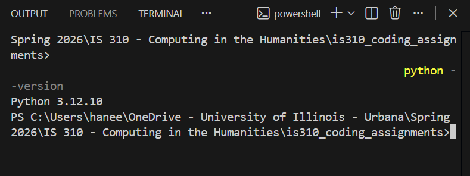
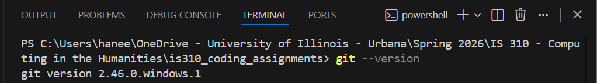
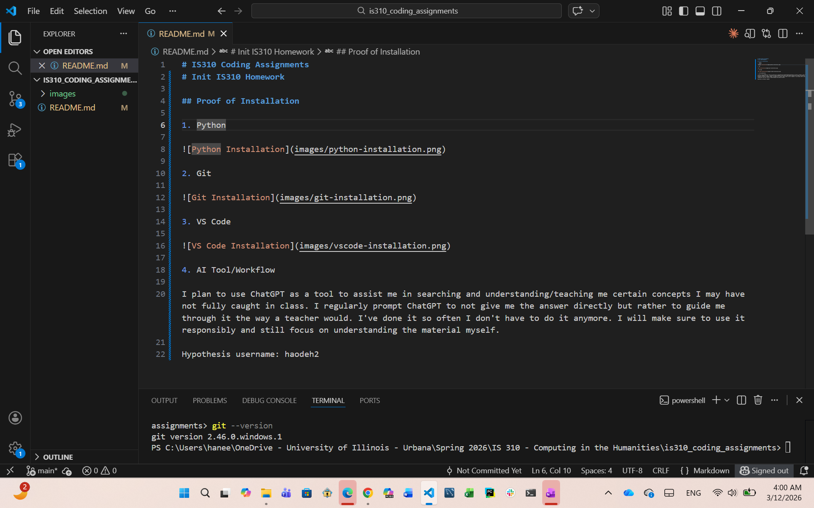

# IS310 Coding Assignments
# Init IS310 Homework

## Proof of Installation

1. Python

2. Git

3. VS Code

4. AI Tool/Workflow

I plan to use ChatGPT as a tool to assist me in searching and understanding/teaching me certain concepts I may have not fully caught in class. I regularly prompt ChatGPT to not give me the answer directly but rather to guide me through it the way a teacher would. I've done it so often I don't have to do it anymore. I will make sure to use it responsibly and still focus on understanding the material myself.

Hypothesis username: haodeh2